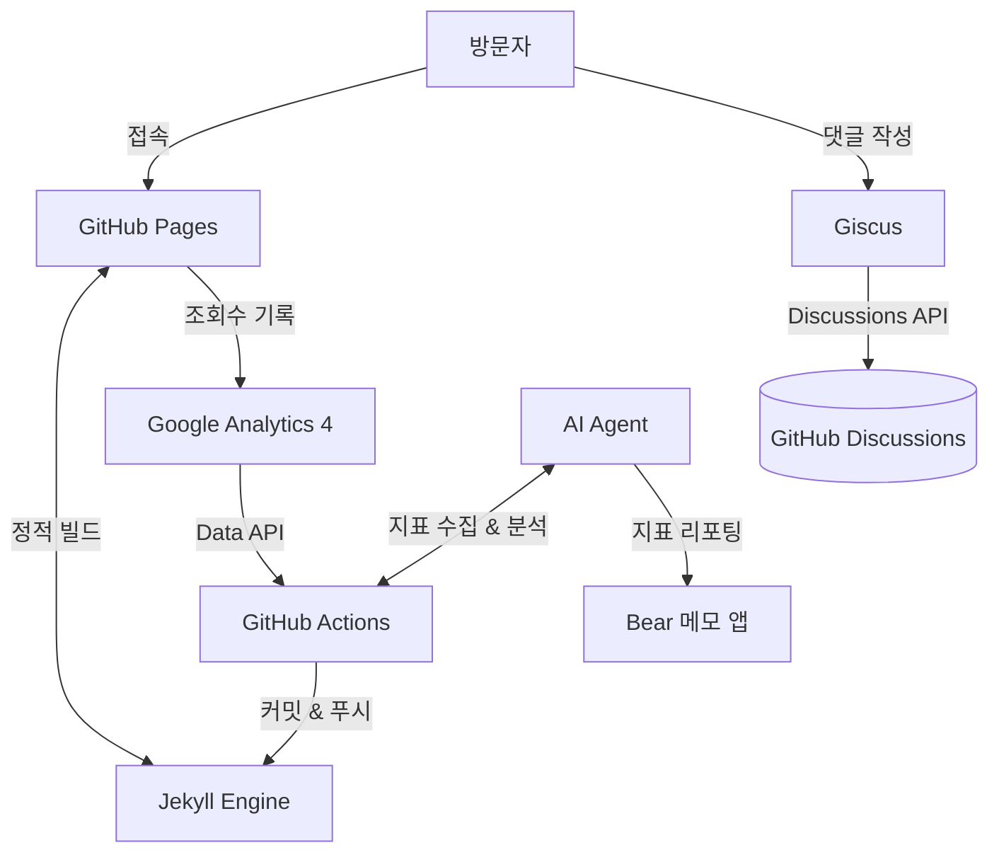

  

    <svg viewBox="0 0 24 24" width="20" height="20" fill="#4B9CD3" style="flex-shrink: 0; display: inline-block; vertical-align: middle; margin-top: -2px;">
      <g>
        <rect x="10.5" y="1" width="3" height="22" rx="1.5"/>
        <rect x="10.5" y="1" width="3" height="22" rx="1.5" transform="rotate(60 12 12)"/>
        <rect x="10.5" y="1" width="3" height="22" rx="1.5" transform="rotate(120 12 12)"/>
      </g>
    </svg>
    이 글은 Gemini 3.5 Flash가 작성하였습니다
  

  이 포스팅은 판교 뚜벅쵸의 일기장과 유튜브 [뚜데] 대본을 통해 구축된 AI 글짓기 페르소나를 기반으로 작성되었습니다. 정적 블로그(Jekyll)에 댓글 및 인기글을 구현한 설계 과정과 모든 지표를 AI로 분석(<code>content-analysis</code>)하는 백엔드 없는 자동화 환경을 다루고 있습니다.

  
목차

  <ul>
    <li><a href="#heavy-youtube">1. 생각을 가볍게 털어놓기에 유튜브는 너무 무겁습니다</a></li>
    <li><a href="#abandoned-blogs">2. 이미 방치된 블로그가 2개나 있습니다만</a></li>
    <li><a href="#github-infrastructure">3. 깃허브 인프라를 극한으로 쥐어짜서 백엔드 없이 구현하기</a></li>
    <li><a href="#ai-analytics">4. 유튜브와 블로그의 모든 지표를 AI로 자동 분석하기</a></li>
    <li><a href="#my-own-land">5. "여긴 제 땅이니까요" — 자유도가 다 내 맘대로</a></li>
  </ul>

요즘은 참 편리한 시대입니다. 

클릭 몇 번에 AI가 기가 막힌 글을 써주기도 하고, 벨로그나 미디엄처럼 걍 로그인하고 타이핑만 하면 예쁘게 포스팅되는 플랫폼들이 널려 있거든요.

근데 저는 지난 5월에 굳이, 진짜 굳이 제 개인 깃허브 블로그([panddu.github.io](https://panddu.github.io))를 새로 만들었습니다. 

사실 제 컴퓨터 구석에는 먼지 쌓인 블로그 공동묘지가 이미 두 개나 있습니다. 
* 옛날에 쓰다 방치한 **티스토리** 하나,
* 그리고 또 다른 **구형 깃허브 블로그** 하나.

원래 블로그라는 게 만들기는 쉬워도 꾸준히 관리하고 글 쓰는 게 세상에서 제일 어렵잖아요? 

그럼에도 불구하고 왜 저는 또다시 깃허브 블로그를 만들었을까요?

---

<h2 id="heavy-youtube">1. 생각을 가볍게 털어놓기에 유튜브는 너무 무겁습니다</h2>

유튜브 영상 하나 만들려면 정말 영혼을 갈아 넣어야 합니다.
* 기획 및 스크립트 작성
* 촬영 장비 세팅 및 촬영
* 지루한 컷 편집과 자막 노동…

솔직히 주말이 통째로 날아갑니다. 직장 생활하면서 가볍게 제 생각이나 개발 에피소드를 그때그때 털어놓고 소통하고 싶었는데, 제작 공수가 너무 커서 부담스럽더라고요. 

결국 텍스트로 돌아와야만 했습니다. 

---

<h2 id="abandoned-blogs">2. 이미 방치된 블로그가 2개나 있습니다만</h2>

"어차피 또 안 쓰고 방치할 거 아니야?"라는 합리적인 의심이 드는 게 당연합니다. 실제로 이미 망해서 버려진 전과가 두 개나 있으니까요.

근데 이번엔 다릅니다. 저에게는 믿는 구석이 있거든요. **바로 AI입니다.**

예전에는 블로그 글 하나 쓰려면 하얀 화면 붙잡고 한 시간 동안 머리를 쥐어짜야 했는데, 이제는 AI가 초안을 기가 막히게 잡아줍니다. 그냥 해주는 게 아니라 제 스타일대로 해줍니다. 

제가 평소에 썼던 일기장이나 유튜브 [뚜데] 시리즈 대본을 싹 긁어다가 AI에게 제 말투와 관점을 제대로 학습(페르소나 구축)시켜 놨거든요. 덕분에 제가 생각나는 아이디어나 기술적인 요점 몇 줄만 툭 던지면, 찰떡같이 제 톤앤매너로 글을 뽑아줍니다. 

심지어 예전에 방치되어 있던 블로그 두 곳의 글들도 AI를 시켜서 마이그레이션을 뚝딱 끝냈습니다. 포맷 변환 같은 귀찮은 노가다를 AI가 대신해주니, 아주 쉽게 새 블로그로 글들을 다 이관하고 판뚜 블로그 하나로 일원화에 성공할 수 있었습니다. 

관리 허들이 10분의 1로 줄어든 셈이죠.

---

<h2 id="github-infrastructure">3. 깃허브 인프라를 극한으로 쥐어짜서 백엔드 없이 구현하기</h2>

기왕 깃허브 블로그를 다시 만드는 거, 서버 한 줄 띄우지 않고 깃허브가 제공하는 인프라 생태계를 백엔드 삼아 구현해보고 싶었습니다. 

서버도 없고 데이터베이스(DB)도 없는 '정적 블로그(Static Blog)'라는 제약이 있었지만, 깃허브의 공짜 인프라를 잘 조합하니 훌륭한 백엔드 아키텍처가 나왔습니다.

전체적인 데이터 흐름과 자동화 파이프라인은 대략 다음과 같은 구조로 돌아갑니다.

### 💬 댓글 시스템은 Giscus로 (깃허브 Discussions 활용)
댓글 데이터를 저장할 DB와 서버를 직접 구축하는 건 너무 귀찮은 일입니다. 그래서 깃허브 레포의 Discussions를 백엔드 DB 삼아 댓글을 보여주는 오픈소스 라이브러리인 <a href="https://giscus.app" target="_blank" rel="noopener noreferrer">Giscus</a>를 채택했습니다. 

이걸 쓰면 제가 관리할 DB 인프라가 0이 된다는 엄청난 장점이 있지만, 반대로 **'댓글을 달려면 방문자도 깃허브 로그인을 해야 한다'**는 치명적인 진입장벽이 존재합니다. 

뭐, 어차피 제 블로그에 들어와서 댓글까지 남겨주실 분들이라면 대부분 깃허브 계정 하나쯤은 있는 개발자분들일 거라는 정신 승리와 함께 타협을 봤습니다.

### 📈 인기글 및 뉴뱃지(빨간점) 갱신을 위한 정적 빌드 자동화
DB가 없다 보니 사용자가 들어올 때마다 실시간 조회수가 긁어와 인기글을 보여주는 기능이 불가능했습니다. 그렇다고 클라이언트 단에서 구글 API를 직접 호출하는 건 보안이나 성능상 불가했고요.

결국 저는 주기적 배치성으로 데이터를 구워버리는 우회로를 썼습니다.
1. 파이썬 표준 라이브러리만 사용해 <a href="https://analytics.google.com" target="_blank" rel="noopener noreferrer">GA4(구글 애널리틱스 4)</a> API에서 조회수 데이터를 긁어옵니다.
2. 긁어온 인기글 정보를 블로그 내부의 `_data/popular_posts.json`에 저장하는 파이썬 스크립트를 작성합니다.
3. 이 스크립트를 **깃허브 액션(GitHub Actions)**으로 매일 한국 시간 자정(`0 15 * * *` UTC)에 돌리도록 크론 설정해두었습니다.

액션이 돌아서 갱신된 JSON을 깃허브 레포에 푸시하면, 깃허브 페이지의 호스팅 인프라가 알아서 새 데이터를 기준으로 정적 블로그를 재빌드해서 뿌려주는 구조입니다.

여기서 재미있는 부수 효과(Side effect)가 하나 더 생깁니다. 제 블로그는 포스트를 쓴 지 24시간 이내의 글에만 'N' 마크나 '빨간점(뉴뱃지)'을 띄우도록 빌드 타임스탬프 기반으로 설계되어 있습니다. 

일반적인 정적 블로그라면 새 글을 올리지 않고 방치할 경우, 이미 작성한 지 며칠이 지난 글도 재빌드가 돌지 않아 빨간점이 계속 켜져 있는 문제가 발생합니다. 

하지만 매일 밤 자정마다 인기글 데이터를 갱신하느라 깃허브 액션이 알아서 사이트를 재빌드해주기 때문에, **오래된 글의 빨간점이 제가 신경 쓰지 않아도 매일 알아서 갱신되어 자동으로 꺼지게 해결되었습니다.**

무료에 대역폭도 무제한인 깃허브의 호스팅(GitHub Pages), 자동화 파이프라인(GitHub Actions), 데이터베이스(GitHub Discussions) 인프라를 쏙쏙 골라 써서 완성도 높은 블로그를 구축하는 맛이 쏠쏠했습니다.

---

<h2 id="ai-analytics">4. 유튜브와 블로그의 모든 지표를 AI로 자동 분석하기</h2>

블로그를 운영하다 보면 조회수는 잘 나오는지, 어디서 유입되는지 분석하고 피드백을 얻는 과정이 필수적입니다. 보통은 GA4나 구글 서치 콘솔, 유튜브 스튜디오 등 관리자 화면을 일일이 열어보는 귀찮은 과정을 거치죠.

하지만 깃허브 블로그와 AI 에이전트를 연동해 두니, 이 지표 분석마저 완벽한 자동화 파이프라인으로 엮을 수 있게 되었습니다.

### 🤖 AI 기반의 Content-Analysis 파이프라인
저는 제 개인 AI 에이전트와 API들을 연계해 유튜브와 블로그의 모든 지표를 한 번에 긁어와 리포팅을 자동화하는 시스템을 구축했습니다. 에이전트가 뒤에서 다음과 같은 인프라와 통신합니다.

* **유튜브 API & Analytics API**: 최신 영상의 성과(조회수, 좋아요)뿐만 아니라, **영상별 예상 수익**, **트래픽 소스 비중**, 유튜브 내 **유입 검색어 Top 10**까지 수집합니다.
* **GA4 & 구글 서치 콘솔 API**: <a href="https://analytics.google.com" target="_blank" rel="noopener noreferrer">GA4</a> & <a href="https://search.google.com/search-console" target="_blank" rel="noopener noreferrer">구글 서치 콘솔</a> API를 활용해 블로그의 최근 페이지뷰, 세션, 참여율 데이터와 더불어 구글 포털을 통한 **검색 클릭수, 노출수, 평균 순위, 인기 검색어**를 조회합니다.
* **Giscus (댓글 API)**: 블로그에 새로 달린 **미응답 댓글**이 있는지 스레드 단위로 긁어옵니다.

에이전트는 매일 이 원시 데이터를 한 번에 수집한 뒤, AI 엔진을 태워 유의미한 분석을 진행합니다. 예를 들어 "조회수 대비 예상 수익이 높은 특정 키워드"를 찾아내거나, "갑자기 노출수가 튀는 검색 키워드"를 감지하여 1~2문장의 인사이트와 함께 깔끔한 한국어 마크다운 리포트로 가공합니다.

그리고 이 최종 리포트는 자동으로 제 메모 앱(Bear)에 `#판교뚜벅쵸/지표리포팅` 태그를 달아 박제됩니다. 매일 아침 저는 에이전트가 구워다 준 밥상(리포트)만 한눈에 확인하면 되는 구조입니다. 플랫폼 관리자 페이지에 종속될 이유가 완전히 사라진 것이죠.

---

<h2 id="my-own-land">5. "여긴 제 땅이니까요" — 자유도가 다 내 맘대로</h2>

네이버 블로그나 티스토리는 플랫폼이 그어놓은 선 안에서 놀아야 합니다. 레이아웃도 뻔하고, 쓸데없는 제약도 많죠. 

근데 깃허브 블로그는 제 단독주택입니다. 제 맘대로 레이아웃을 뜯어고칠 수 있는 건 기본이고, 내키면 본문 한가운데에 [스팸체 생성기](/posts/2019/04/spammaker/) 같은 엉뚱한 자바스크립트 코드를 걍 박아버려도 아무도 눈치 주지 않습니다. 

지표 추적이나 수익화도 플랫폼 종속적일 필요가 전혀 없습니다. 
* <a href="https://analytics.google.com" target="_blank" rel="noopener noreferrer">GA4</a>나 요즘 잘 나오는 <a href="https://www.goatcounter.com" target="_blank" rel="noopener noreferrer">GoatCounter</a> 같은 가벼운 분석 도구도 제 맘대로 연동하면 되고,
* 애드센스도 제 입맛대로 달 수 있으니까요.

자유도가 백 퍼센트 보장되다 보니 장난감 조립하듯 블로그를 만지는 재미 자체가 쏠쏠합니다.

---

### 마치며

과거의 깃허브 블로그가 '고독한 삽질의 연속'이었다면, AI 시대의 깃허브 블로그는 'AI라는 유능한 조수를 데리고 내 맘대로 짓는 아지트'에 가깝습니다. 

내가 온전히 지배하는 공간에서, 나만의 호흡으로 기록을 쌓아가는 즐거움. 그리고 그 귀찮은 과정을 AI 덕분에 즐거운 놀이로 바꿀 수 있게 된 것. 이게 제가 굳이 지금 깃허브 블로그를 다시 시작한 진짜 이유입니다.

아.. 쓰다 보니 또 너무 진지해졌네요. 죄송합니다. 

암튼, 깃허브 블로그는 귀찮음을 감수할 만큼 충분히 매력적인 놀이터입니다. 

혹시 블로그 개설을 망설이고 계신 분들이 있다면, AI 든든하게 옆에 끼고 한번 본인만의 아지트를 지어보시는 건 어떨까 싶습니다. 😄
